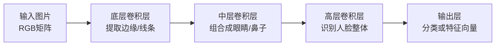

# 面部识别技术解析：从规则引擎到深度学习

*(面向软件开发工程师的 AI 科普)*

> **📝 导读：** 作为软件工程师，我们习惯了用 `if-else` 和确定的逻辑来构建系统。但在图像识别领域，面对海量的非结构化数据（像素），传统的规则引擎往往束手无策。本文将带你了解面部识别技术是如何从“手动编写规则”演变到“数据驱动学习”的。

***

## 一、 机器眼中的世界：图像即多维数组（Tensor）

> **💡 原文回放**：一张图片的背后是大量的数字（0-255）组成的，它们代表三原色。
> **🔍 补充与勘误**：表达基本正确，但从数据结构的角度来看，图片在内存中其实是一个**多维数组（Tensor/张量）**。

在计算机眼中，没有“生动的人脸”，只有矩阵数据：

- **灰度图**：一个二维数组 `[Height][Width]`，每个元素的值在 `0-255` 之间，代表亮度（0为黑，255为白）。
- **彩色图**：通常包含 R（红）、G（绿）、B（蓝）三个通道（三原色），可以理解为一个三维数组 `[Height][Width][3]`。

***

## 二、 传统机器视觉时代：手动提取特征（Feature Engineering）

在深度学习爆发前，科学家们试图通过数学算子来提取图像的“特征”，这就像是我们试图为图像识别手写各种复杂的正则表达式。

### 1. 边缘检测：Sobel 算子

> **💡 原文回放**：上世纪研究出来的sabel算子，可以用于检测图片中的边缘...
> **⚠️ 勘误提示**：拼写错误，应为 **Sobel算子**。

**工作原理（程序员视角）**：
如何让计算机找到图像的边缘？边缘通常是**像素值发生剧烈变化**的地方。Sobel算子本质上是一个**卷积核（一个小矩阵）**，它在图像的二维数组上进行滑动窗口计算（Sliding Window）。
原稿中“右边元素亮度减左边元素亮度”是一个非常好的简化理解，这在数学上叫**求梯度（一阶导数）**。

- **正数**：右边比左边亮（从暗到亮的边缘）。
- **负数**：左边比右边亮（从亮到暗的边缘）。
- **接近0**：平坦区域，没有边缘。

*(图示：一维梯度计算模拟)*

```text
像素亮度:  [10, 10, 10, 200, 200, 200]
                  \  |  /    \  |  /
梯度(差值):   [ 0,  0, 190,  0,  0 ]  <-- 190 所在的位置就是边缘！
```

### 2. 传统方法的瓶颈

> **💡 原文回放**：科学家想要基于各种特征...但是这些特征都是手动设计的，需要花费很多的时间和精力，识别效果也不好。

早期科学家设计了 Haar、HOG 等特征来描述人脸形状。
**痛点**：这就好比用硬编码的 `if (has_two_eyes && has_one_nose)` 来识别，规则太复杂、特例太多（光照、遮挡、角度变化），导致代码的**泛化能力极差**。检测器是固定的。 人类能想到的特征就那么多，能手动设计的检测器也就那么多。不管你后面的统计模型多厉害，输入它的那些特征就这些——如果特征本身不够好，分类结果就上不去。

***

## 三、 深度学习时代：从人为设计走向自动学习

既然手动写规则行不通，不如写一个“能自动找出规则”的程序。

> **💡 原文回放**：2012年，李飞飞教授提供了标注好的图片库，吴恩达教授提出了可以用GPU来加速...alexnet诞生了...五年后当准确率超过95%，李飞飞教授结束了比赛。
> **⚠️ 勘误提示**：这里的历史人物和事件有些错位。
>
> 1. **ImageNet**：由李飞飞教授团队于 **2009年** 发布，为AI提供了海量的“训练测试集”。
> 2. **GPU加速**：吴恩达教授确实是极早倡导用 GPU 训练神经网络的先驱，但 **AlexNet** 是由 Alex Krizhevsky 及其导师 **Geoffrey Hinton**（深度学习鼻祖）在 2012 年提出的。
> 3. **比赛结束**：ImageNet 图像分类比赛（ILSVRC）由于机器的错误率降到了 5% 以下（超越人类肉眼水平），于 2017 年正式停办。

### 1. 核心机制：让代码“自己改Bug”

> **💡 原文回放**：电脑从正确标注的图片自己调整出来检测器(反向传播...)

神经网络训练本质上是一个超大规模的参数寻优过程：

- **前向传播 (Forward Propagation)**：图片输入网络，输出一个预测结果（比如：80% 概率是人脸）。
- **损失函数 (Loss Function)**：计算预测结果与真实标签的差距，类似于跑单元测试时得到的 `Expected vs Actual`。
- **反向传播 (Backpropagation)**：核心魔法！通过链式法则，将“错误差异”一层层向后传递，计算出每个参数（权重）对这个错误的“责任大小”，然后微调参数。这就好比系统出了Bug，顺着调用栈（Call Stack）一层层往回找，谁的问题大就改谁的代码。

### 2. 卷积神经网络 (CNN) 的层级抽象

> **💡 原文回放**：像素，边缘，形状，部件，整体，一层一层的叠加检测器（这就是神经网络的结构）
> **🔍 补充**：非常准确！这体现了 CNN 的**层级特征提取**。



### 3. 算法层面的两大功臣：ReLU 与 Dropout

在 AlexNet 之前，神经网络一旦层数加深，就极容易“跑飞”或者“学废”。AlexNet 能把网络做深，很大程度上归功于这两个看似极其简单的机制：

**① ReLU (激活函数) 与“梯度消失”的克星**

- **它是什么**：代码层面它极其简单：`f(x) = max(0, x)`。只要输入是正数，就原样输出；如果是负数，就输出 0。
- **解决了什么问题（非线性）**：如果没有激活函数，无论叠加多少层网络，在数学上都等价于一个简单的线性回归（即只能画直线）。ReLU 引入了“非线性”，让网络拥有了表达复杂逻辑（类似 `if-else` 的条件分支）的能力。
- **解决了什么问题（梯度消失 Vanishing Gradient）**：
  - **科普**：在反向传播（改 Bug）时，误差需要一层层往前传。早期的激活函数（如 Sigmoid）像一个压缩机，会把很大的输入压缩到 0\~1 之间。这就导致：误差每往前传一层，就被缩小一点。传了十几层后，误差（梯度）就趋近于 0 了。最底层的参数根本接收不到修改信号，这就叫“梯度消失”。
  - **ReLU 的奇效**：因为 `f(x) = x`（当 x>0 时），它的导数（梯度）永远是 1！这就相当于建立了一条“误差传递的高速公路”，无论网络多深，误差信号都能原汁原味地传到底层，让深度网络的训练成为了可能。

**② Dropout 与“过拟合”的对抗**

- **科普：什么是过拟合（Overfitting）？**
  - 想象一个学生做历年真题，他不去理解解题思路，而是把每一题的答案死记硬背下来。平时小测验（训练集）拿 100 分，一到真正的大考（测试集）就立刻不及格。
  - 在神经网络中也是一样：如果模型参数太多，它可能会把训练集里的背景噪音、光线瑕疵都当成了“识别特征”强行记住，导致换一张新图片就认不出来，这就叫“泛化能力差”或“过拟合”。
- **它是什么**：在每次训练时，**随机**让网络中一定比例（比如 50%）的神经元“断开连接”（输出设为 0），不参与当前的计算和更新。
- **解决了什么问题**：
  - 这类似于微服务架构中的“混沌工程 (Chaos Engineering)”——随机干掉几个节点。
  - 这种机制逼迫网络不能依赖某几个特定的“作弊”神经元，而是必须让所有神经元都去学习普适的、鲁棒的人脸特征。大家分摊任务，互相备份，从而有效防止了模型“死记硬背”，极大提升了模型在真实场景下的泛化能力。

***

## 四、 现代面部识别的工作流 (Pipeline)

当我们拿起手机解锁时，背后的微服务调用链路大致如下：

1. **数据采集 (Data Acquisition)**
   - 摄像头、红外线传感器扫描面部，转化为数字矩阵。红外或3D结构光用于**活体检测 (Liveness Detection)**，防止别人拿照片来攻击系统。
2. **特征提取 (Feature Extraction)**
   - 经过深度神经网络（如 ResNet/MobileNet 等模型）的处理，图像矩阵被压缩、降维。
3. **特征向量 (Feature Vector / Embedding)**
   - **重点概念**：网络输出的最终结果是一个**浮点数数组**（通常长度为128或512）。
   - **工程师类比**：你可以把它理解为人脸的 **“语义 Hash 值”**。同一个人的不同照片，算出的这个数组（向量）非常接近。
4. **向量检索与比对 (Vector Matching)**
   - 当你解锁时，系统提取你当前的“人脸向量”，与注册时保存在手机安全芯片（或数据库）中的“人脸向量”进行对比。
   - **算法**：通常计算两个向量的**余弦相似度 (Cosine Similarity)** 或欧氏距离。这就类似于向量数据库（如 Milvus/Pinecone）底层的检索原理。
5. **鉴权输出 (Authentication)**
   - 如果相似度大于设定的阈值（Threshold，例如 > 0.85），则返回 `True` 予以解锁。

***

> **💡 总结**：现代面部识别本质上是将“非结构化的图像像素”，通过深度学习模型，降维编码成“结构化的浮点数数组（向量）”，最后转化为高维空间中的数学距离计算问题。

